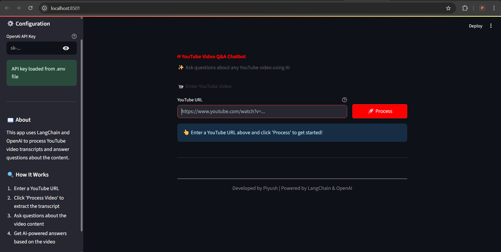

# YouTube Chatbot

A Python application that allows you to ask questions about YouTube videos based on their transcripts. The chatbot uses LangChain and OpenAI's language models to provide accurate answers based on the video content.

## Overview

This project uses Retrieval-Augmented Generation (RAG) to create a chatbot that can answer questions about YouTube videos. The process works as follows:

1.  **Transcript Extraction**: The application extracts the transcript from a YouTube video.
2.  **Text Processing**: The transcript is split into manageable chunks.
3.  **Embedding Generation**: Each chunk is converted into a vector embedding.
4.  **Retrieval**: When a question is asked, the most relevant chunks are retrieved.
5.  **Answer Generation**: An LLM generates an answer based on the retrieved context.

## Features

-   Extract transcripts from YouTube videos
-   Process and index video content for efficient retrieval
-   Ask questions about the video content
-   Get accurate answers based on the video transcript

## Setup Instructions

### Prerequisites

-   Python 3.8 or higher
-   pip (Python package installer)

### Installation

1.  Clone this repository or download the source code.

2.  Install the required dependencies:
    ```bash
    pip install -r requirements.txt
    ```

## 🎯 Usage

1.  After installing dependencies, create a `.env` file in the project root directory with your OpenAI API key:

    ```ini
    OPENAI_API_KEY=your_openai_api_key_here
    ```

2.  To launch the Streamlit app, run the following command in your terminal:

    ```bash
    streamlit run app.py
    ```

3.  Then open your browser and go to `http://localhost:8501`.

## 🛠 Configuration

Make sure you have a valid OpenAI API key. You can create one [here](https://platform.openai.com/account/api-keys).

## 💻 How to Use

1.  Enter the YouTube video URL in the input field.
2.  Click "Process Video" to extract and process the transcript.
3.  Enter your question about the video content.
4.  Get an AI-generated answer based on the transcript.

## 📷 Example Screenshot



---

## 🚀 Future Enhancements

-   **Playlist and Channel Support:**
    Allow users to input a YouTube playlist or channel URL to create a chatbot that can answer questions across multiple videos, providing a much broader knowledge base.

-   **Persistent Vector Storage:**
    Integrate a persistent vector database like **ChromaDB** or **Pinecone**. This would allow the application to save processed video embeddings, so users don't have to re-process the same video every time they launch the app.

-   **Source Linking with Timestamps:**
    Enhance the answers by providing direct links to the specific timestamps in the YouTube video where the information was found. This would allow users to instantly verify the source of the answer.

-   **Conversational Memory:**
    Implement a chat history so the chatbot can remember the context of the current conversation, allowing users to ask follow-up questions like "Can you elaborate on that last point?".

-   **Support for Other LLMs:**
    Add a configuration option to switch between different language models, including open-source alternatives like models from Hugging Face, giving users more flexibility and control.

-   **Enhanced UI:**
    Improve the Streamlit UI to include features like a history of processed videos, the ability to manage and delete stored video indexes, and a clearer display of the retrieved source chunks.

## 🪪 License

This project is licensed under the MIT License. Feel free to modify and use it for your own purposes.
